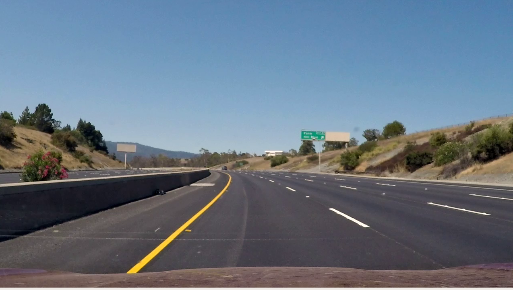
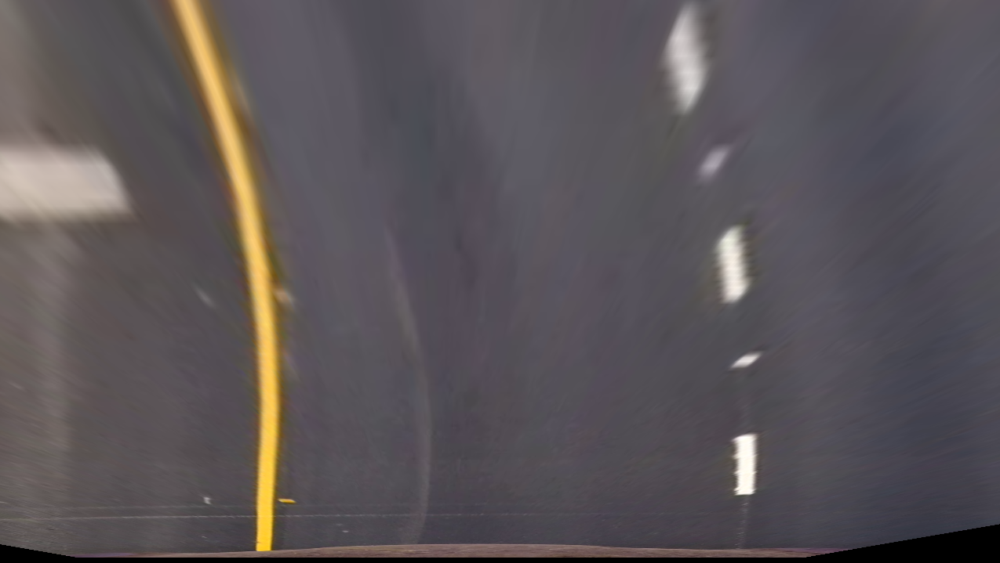
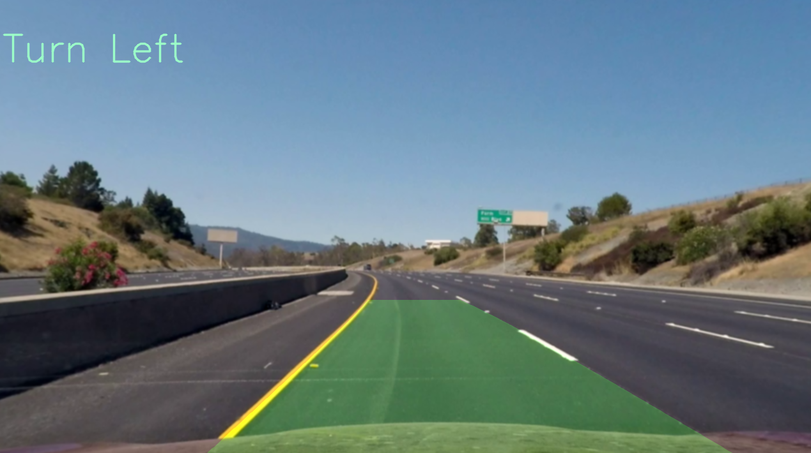

# Lane-Detection
  This project is implemented to detect lane and predict the turn of the given video. The pipeline is as follows.

  * The video is taken frame by frame.
  * The frame is undistorted using camera parameters.
  * Noise in the frame is removed using Gaussian filter.
  * Bottom half of the frame is taken as Region of Interest.
  * Homography is applied to the frame to get the bird's view of the road.
  * Histogram is taken to detect the lane lines in the road.
  * Lane lines are filtered using color segmentation.
  * A polynomial is fitted to both right and left line of the road.
  * The polynomial is superimposed back to the original frame using inverse Homography.

## Results
  
## Run Instruction
1. Run the Lane_Detection.py.
2. Select the video by entering either 1 or 2.
